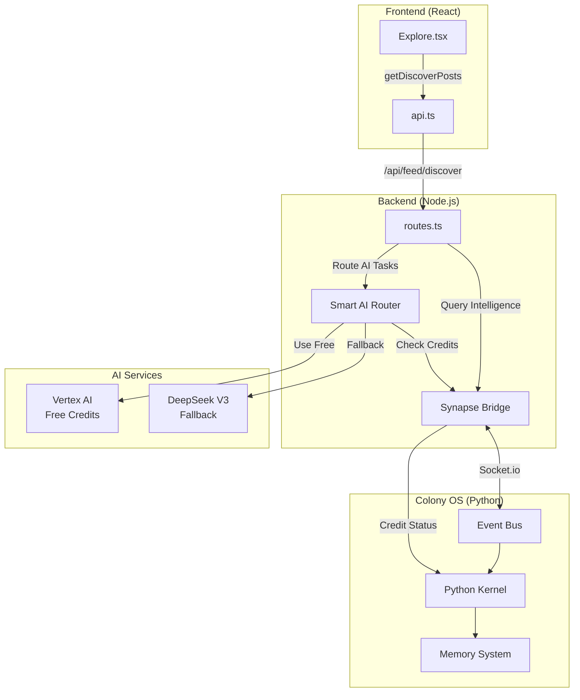

# Colony OS Integration & Discovery Fixes

## Overview

This plan implements three critical improvements to connect Zyeuté with Colony OS and fix discovery features:

1. **Block 1: Discovery API Fix** - Fix Explore.tsx to properly use discovery endpoints
2. **Block 2: Synapse Bridge** - Complete real-time connection to Colony OS Python kernel
3. **Block 3: Smart AI Router** - Credit-aware AI routing (Vertex AI → DeepSeek fallback)

## Architecture Flow



## Execution Order

**Start with Block 1** → **Then Block 2** → **Then Block 3**

Each block is independent and can be tested separately, but Block 3 requires Block 2 to be complete.

---

## Block 1: Discovery API Fix (30 minutes)

### Goal

Fix Explore.tsx to properly call discovery endpoints with correct parameters and fallback logic. The `api.ts` file is already correct - only Explore.tsx needs changes.

### Current State Analysis

- ✅ `api.ts` already has correct `getDiscoverPosts` implementation
- ✅ Uses correct endpoint: `/feed/discover`
- ✅ Uses correct types: `"tags" | "vibe" | "recommended"`
- ⚠️ `Explore.tsx` has discovery logic but may need refinement
- ⚠️ Need to ensure recommended fallback works for logged-out users

### Files to Modify

- **[zyeute/frontend/src/pages/Explore.tsx](zyeute/frontend/src/pages/Explore.tsx)**
  - Verify `fetchPosts` callback uses correct `getDiscoverPosts` signature
  - Ensure recommended fallback handles both logged-in and logged-out users
  - Fix dependency array if needed
  - Add better error handling for discovery tab

### Implementation Details

1. **Verify fetchPosts function** (lines 89-166):
   - Current code already uses `getDiscoverPosts` correctly
   - Uses `selectedAITags.join(",")` for tags query (correct)
   - Has recommended fallback (line 121-124)
   - **Action**: Verify it handles logged-out users gracefully (may need to fallback to trending)

2. **Add graceful fallback for logged-out users**:
   - If `type: "recommended"` returns 401 (not authenticated)
   - Fallback to `getExplorePosts` (trending) instead of empty state
   - This ensures discovery tab always shows content

3. **Update dependency array** (line 166):
   - Current: `[selectedRegion, selectedHashtag, searchQuery, activeTab, selectedVibe, selectedAITags, savedState]`
   - **Action**: Remove `savedState` from deps (it's only used for comparison, not as a dependency)
   - This prevents unnecessary re-fetches

### Code Changes Required

```typescript
// zyeute/frontend/src/pages/Explore.tsx

// In fetchPosts callback (around line 89):
const fetchPosts = React.useCallback(async () => {
  // ... existing skip logic ...

  setIsLoading(true);
  try {
    let explorePosts: Post[] = [];

    if (activeTab === "discover") {
      // Use discovery feed
      if (selectedVibe) {
        explorePosts = await getDiscoverPosts({
          type: "vibe",
          vibe: selectedVibe,
          limit: 50,
        });
      } else if (selectedAITags.length > 0) {
        explorePosts = await getDiscoverPosts({
          type: "tags",
          query: selectedAITags.join(","),
          limit: 50,
        });
      } else {
        // Default: get recommended posts (if user is logged in) or trending
        try {
          explorePosts = await getDiscoverPosts({
            type: "recommended",
            limit: 50,
          });
        } catch (error: any) {
          // If not authenticated, fallback to trending
          if (error?.message?.includes("401") || error?.message?.includes("Authentication")) {
            exploreLogger.info("User not authenticated, falling back to trending");
            explorePosts = await getExplorePosts(0, 50);
          } else {
            throw error;
          }
        }
      }
    } else {
      // Use the dedicated explore endpoint for better performance/discovery
      explorePosts = await getExplorePosts(0, 50, selectedRegion);
    }

    // ... rest of filtering logic ...
  } catch (error) {
    exploreLogger.error("Error fetching posts:", error);
    toast.error("Impossible de charger les posts. Vérifie ta connexion.");
  } finally {
    setIsLoading(false);
  }
}, [selectedRegion, selectedHashtag, searchQuery, activeTab, selectedVibe, selectedAITags]); // Remove savedState from deps
```

### Success Criteria

- Discovery tab shows personalized recommendations when no filters selected (if logged in)
- Discovery tab shows trending posts when not logged in (graceful fallback)
- Tag filtering works correctly
- Vibe filtering works correctly
- No empty states for any user scenario
- Dependency array doesn't cause unnecessary re-fetches

---

## Block 2: Synapse Bridge (1 hour)

### Goal

Complete the real-time Socket.io connection between Zyeuté backend and Colony OS Python kernel. Replace the basic HTTP bridge with a full-featured Socket.io bridge.

### Current State Analysis

- ✅ Basic HTTP bridge exists (`backend/colony/bridge.ts`)
- ✅ Metrics bridge exists (`backend/colony/metrics-bridge.ts`)
- ❌ No Socket.io real-time connection
- ❌ No event publishing to Colony OS
- ❌ No intelligence querying from Colony OS

### Files to Create/Modify

- **[zyeute/backend/colony/synapse-bridge.ts](zyeute/backend/colony/synapse-bridge.ts)** (Create New)
  - Implement Socket.io client connection
  - Add event publishing (`publishEvent`)
  - Add intelligence querying (`requestIntelligence`)
  - Add reconnection logic and error handling
  - Add connection status tracking

- **[zyeute/backend/index.ts](zyeute/backend/index.ts)**
  - Initialize Synapse Bridge on server startup
  - Handle graceful shutdown
  - Add connection status logging

- **[zyeute/backend/routes.ts](zyeute/backend/routes.ts)**
  - Integrate Synapse Bridge for event publishing
  - Publish events: `post.created`, `user.new`, `ai.usage`
  - Add endpoint: `GET /api/colony/status` to check connection

### Implementation Details

1. **Create SynapseBridge Class**:

```typescript
// zyeute/backend/colony/synapse-bridge.ts

import { io, Socket } from "socket.io-client";
import { EventEmitter } from "events";

class SynapseBridge extends EventEmitter {
  private socket: Socket | null = null;
  private colonyUrl: string;
  private reconnectAttempts = 0;
  private maxReconnectAttempts = 5;
  private isConnecting = false;

  constructor() {
    super();
    this.colonyUrl = process.env.COLONY_OS_URL || "http://localhost:10000";
  }

  async connect(): Promise<void> {
    if (this.isConnecting || this.socket?.connected) return;
    
    this.isConnecting = true;
    
    this.socket = io(this.colonyUrl, {
      auth: {
        hive: "zyeute",
        token: process.env.COLONY_API_KEY || "dev-key"
      },
      transports: ["websocket"],
      reconnection: true,
      reconnectionAttempts: this.maxReconnectAttempts,
      reconnectionDelay: 1000,
      reconnectionDelayMax: 5000,
      timeout: 10000
    });

    this.socket.on("connect", () => {
      console.log("⚜️ [Synapse] Connected to Colony OS kernel");
      this.reconnectAttempts = 0;
      this.isConnecting = false;
      this.emit("connected");
      
      // Join Quebec hive channel
      this.socket?.emit("join_channel", "quebec_social");
    });

    this.socket.on("disconnect", (reason) => {
      console.log(`⚜️ [Synapse] Disconnected: ${reason}`);
      this.isConnecting = false;
      this.emit("disconnected", reason);
    });

    this.socket.on("connect_error", (error) => {
      this.reconnectAttempts++;
      console.warn(`⚜️ [Synapse] Connection error (${this.reconnectAttempts}/${this.maxReconnectAttempts}):`, error.message);
      this.isConnecting = false;
      
      if (this.reconnectAttempts >= this.maxReconnectAttempts) {
        console.error("⚜️ [Synapse] Max reconnection attempts reached. Operating in standalone mode.");
        this.emit("connection_failed");
      }
    });

    // Handle Colony OS events
    this.socket.on("colony.task.assigned", (task) => {
      console.log("⚜️ [Synapse] Task assigned by Colony OS:", task.id);
      this.emit("task", task);
    });

    this.socket.on("colony.intelligence", (data) => {
      console.log("⚜️ [Synapse] Intelligence received from Colony OS");
      this.emit("intelligence", data);
    });
  }

  async publishEvent(event: string, data: any): Promise<void> {
    if (!this.socket?.connected) {
      console.warn(`⚜️ [Synapse] Not connected, queuing event: ${event}`);
      // Could implement event queue here for offline events
      return;
    }

    this.socket.emit("hive.event", {
      hive: "zyeute",
      event,
      data,
      timestamp: new Date().toISOString()
    });
  }

  async requestIntelligence(query: string): Promise<any> {
    return new Promise((resolve, reject) => {
      if (!this.socket?.connected) {
        reject(new Error("Synapse bridge not connected to Colony OS"));
        return;
      }

      const requestId = crypto.randomUUID();
      
      const handler = (response: any) => {
        if (response.requestId === requestId) {
          this.socket?.off("colony.intelligence.response", handler);
          resolve(response.data);
        }
      };

      this.socket.on("colony.intelligence.response", handler);
      
      this.socket.emit("hive.request.intelligence", {
        requestId,
        query,
        hive: "zyeute"
      });

      // Timeout after 15 seconds
      setTimeout(() => {
        this.socket?.off("colony.intelligence.response", handler);
        reject(new Error("Colony OS intelligence request timeout"));
      }, 15000);
    });
  }

  disconnect(): void {
    if (this.socket) {
      this.socket.disconnect();
      this.socket = null;
    }
  }

  isConnected(): boolean {
    return this.socket?.connected || false;
  }

  getConnectionStatus(): "connected" | "disconnected" | "connecting" | "failed" {
    if (this.isConnecting) return "connecting";
    if (this.socket?.connected) return "connected";
    if (this.reconnectAttempts >= this.maxReconnectAttempts) return "failed";
    return "disconnected";
  }
}

export const synapseBridge = new SynapseBridge();
```

2. **Integrate into Backend Startup**:

```typescript
// zyeute/backend/index.ts

import { synapseBridge } from "./colony/synapse-bridge.js";

// In the async startup function:
(async () => {
  try {
    // ... existing setup ...
    
    // Initialize Colony OS Synapse Bridge
    if (process.env.COLONY_OS_URL) {
      await synapseBridge.connect();
      synapseBridge.on("connected", () => {
        console.log("✅ Colony OS Synapse Bridge connected");
      });
      synapseBridge.on("disconnected", () => {
        console.warn("⚠️ Colony OS Synapse Bridge disconnected");
      });
    } else {
      console.log("ℹ️ Colony OS URL not configured, skipping Synapse Bridge");
    }
    
    // ... rest of startup ...
  } catch (error) {
    // ... error handling ...
  }
})();

// Graceful shutdown
process.on("SIGTERM", () => {
  synapseBridge.disconnect();
  // ... other cleanup ...
});
```

3. **Integrate Event Publishing**:

```typescript
// zyeute/backend/routes.ts

import { synapseBridge } from "./colony/synapse-bridge.js";

// In registerRoutes function:

// After creating a post:
app.post("/api/posts", requireAuth, async (req, res) => {
  try {
    // ... create post logic ...
    
    // Publish event to Colony OS
    await synapseBridge.publishEvent("post.created", {
      postId: post.id,
      userId: req.userId,
      type: post.type,
      hiveId: post.hiveId
    });
    
    // ... rest of response ...
  } catch (error) {
    // ... error handling ...
  }
});

// Add status endpoint:
app.get("/api/colony/status", async (req, res) => {
  res.json({
    connected: synapseBridge.isConnected(),
    status: synapseBridge.getConnectionStatus(),
    url: process.env.COLONY_OS_URL || "not configured"
  });
});
```

### Success Criteria

- Backend connects to Colony OS on startup (if URL configured)
- Events are published successfully (`post.created`, `user.new`, etc.)
- Intelligence queries return data (credit status, trends, etc.)
- Graceful handling of disconnections
- Status endpoint shows connection state
- Works in standalone mode if Colony OS unavailable

---

## Block 3: Smart AI Router + Credit Management (2 hours)

### Goal

Implement credit-aware AI routing that uses Vertex AI free credits first, then falls back to DeepSeek when credits are exhausted.

### Current State Analysis

- ✅ Vertex AI service exists (`backend/ai/vertex-service.ts`)
- ✅ `analyzeImageWithGemini` function exists
- ✅ Video processor uses Vertex AI directly (line 183)
- ❌ No DeepSeek Vision service
- ❌ No credit-aware routing
- ❌ No integration with Colony OS for credit checks

### Files to Create/Modify

- **[zyeute/backend/ai/credit-manager.ts](zyeute/backend/ai/credit-manager.ts)** (Create)
  - Track Vertex AI credit usage
  - Check credit status via Colony OS Synapse Bridge
  - Determine active service (vertex vs deepseek)
  - Cache credit status with TTL

- **[zyeute/backend/ai/deepseek-vision.ts](zyeute/backend/ai/deepseek-vision.ts)** (Create)
  - DeepSeek Vision API implementation
  - Image analysis function matching Vertex AI signature
  - Error handling and retry logic
  - Return same format as Vertex AI

- **[zyeute/backend/ai/smart-ai-router.ts](zyeute/backend/ai/smart-ai-router.ts)** (Create)
  - Credit-aware routing logic
  - Integration with Synapse Bridge for credit checks
  - Fallback chain: Vertex AI → DeepSeek → Error
  - Usage reporting to Colony OS

- **[zyeute/backend/workers/videoProcessor.ts](zyeute/backend/workers/videoProcessor.ts)**
  - Replace direct Vertex AI call with Smart AI Router
  - Update to use `analyzeVideoThumbnail` from router
  - Maintain existing error handling (non-blocking)

### Implementation Details

1. **Create Credit Manager**:

```typescript
// zyeute/backend/ai/credit-manager.ts

import { synapseBridge } from "../colony/synapse-bridge.js";

interface CreditStatus {
  vertexCreditsRemaining: number;
  vertexCreditsUsed: number;
  cutoffThreshold: number;
  activeService: "vertex" | "deepseek";
  lastCheck: Date;
}

class CreditManager {
  private creditStatus: CreditStatus | null = null;
  private creditCacheTTL = 60000; // 1 minute cache
  private cutoffThreshold: number;

  constructor() {
    this.cutoffThreshold = parseInt(process.env.VERTEX_CREDIT_CUTOFF || "100"); // $1 in cents
  }

  async getActiveService(): Promise<"vertex" | "deepseek"> {
    // Check cache first
    if (this.creditStatus && Date.now() - this.creditStatus.lastCheck.getTime() < this.creditCacheTTL) {
      return this.creditStatus.activeService;
    }

    // Query Colony OS for credit status
    try {
      if (synapseBridge.isConnected()) {
        const status = await synapseBridge.requestIntelligence("get_vertex_credit_status");
        this.creditStatus = {
          vertexCreditsRemaining: status.remaining || Infinity,
          vertexCreditsUsed: status.used || 0,
          cutoffThreshold: this.cutoffThreshold,
          activeService: status.remaining > this.cutoffThreshold ? "vertex" : "deepseek",
          lastCheck: new Date()
        };
      } else {
        // If Colony OS unavailable, assume Vertex credits available (use free credits)
        this.creditStatus = {
          vertexCreditsRemaining: Infinity,
          vertexCreditsUsed: 0,
          cutoffThreshold: this.cutoffThreshold,
          activeService: "vertex",
          lastCheck: new Date()
        };
      }
    } catch (error) {
      console.warn("⚠️ [CreditManager] Could not check credit status, defaulting to Vertex AI");
      // Default to Vertex AI if check fails (use free credits)
      this.creditStatus = {
        vertexCreditsRemaining: Infinity,
        vertexCreditsUsed: 0,
        cutoffThreshold: this.cutoffThreshold,
        activeService: "vertex",
        lastCheck: new Date()
      };
    }

    return this.creditStatus.activeService;
  }

  trackUsage(service: "vertex" | "deepseek", cost: number): void {
    if (service === "vertex" && this.creditStatus) {
      this.creditStatus.vertexCreditsUsed += cost;
      this.creditStatus.vertexCreditsRemaining -= cost;
      
      // Report to Colony OS
      synapseBridge.publishEvent("ai.usage", {
        service: "vertex",
        cost,
        remaining: this.creditStatus.vertexCreditsRemaining
      }).catch(err => console.warn("Failed to report usage to Colony OS:", err));
    }
  }

  getStatus(): CreditStatus | null {
    return this.creditStatus;
  }
}

export const creditManager = new CreditManager();
```

2. **Create DeepSeek Vision Service**:

```typescript
// zyeute/backend/ai/deepseek-vision.ts

interface ImageAnalysisResult {
  caption: string;
  tags: string[];
  detected_objects: string[];
  vibe_category: string;
  confidence: number;
}

export async function analyzeImageWithDeepSeek(
  imageBase64: string,
  mimeType: string = "image/jpeg"
): Promise<ImageAnalysisResult> {
  const apiKey = process.env.DEEPSEEK_API_KEY;
  if (!apiKey) {
    throw new Error("DEEPSEEK_API_KEY not configured");
  }

  const response = await fetch("https://api.deepseek.com/v1/chat/completions", {
    method: "POST",
    headers: {
      "Authorization": `Bearer ${apiKey}`,
      "Content-Type": "application/json",
    },
    body: JSON.stringify({
      model: "deepseek-chat",
      messages: [
        {
          role: "user",
          content: [
            {
              type: "text",
              text: `Analyze this video thumbnail and extract metadata in JSON format:
{
  "caption": "A Quebecois-style caption describing the scene (in joual if appropriate)",
  "tags": ["tag1", "tag2", "tag3", "tag4", "tag5"],
  "detected_objects": ["object1", "object2"],
  "vibe_category": "party|chill|nature|food|urban|art|hockey|hiver",
  "confidence": 0.95
}

Focus on Quebec culture, hockey, winter scenes, poutine, Montreal, Quebec City, etc.`
            },
            {
              type: "image_url",
              image_url: {
                url: `data:${mimeType};base64,${imageBase64}`
              }
            }
          ]
        }
      ],
      max_tokens: 500,
      temperature: 0.7
    }),
  });

  if (!response.ok) {
    const errorText = await response.text();
    throw new Error(`DeepSeek API error ${response.status}: ${errorText}`);
  }

  const data = await response.json();
  const content = data.choices?.[0]?.message?.content;
  
  if (!content) {
    throw new Error("No response from DeepSeek API");
  }

  // Parse JSON from response
  try {
    const jsonMatch = content.match(/\{[\s\S]*\}/);
    const analysis = jsonMatch ? JSON.parse(jsonMatch[0]) : JSON.parse(content);
    
    return {
      caption: analysis.caption || "Une scène captivante",
      tags: analysis.tags || [],
      detected_objects: analysis.detected_objects || [],
      vibe_category: analysis.vibe_category || "chill",
      confidence: analysis.confidence || 0.8
    };
  } catch (parseError) {
    // Fallback: extract basic info from text
    return {
      caption: content.substring(0, 100),
      tags: [],
      detected_objects: [],
      vibe_category: "chill",
      confidence: 0.5
    };
  }
}
```

3. **Create Smart AI Router**:

```typescript
// zyeute/backend/ai/smart-ai-router.ts

import { analyzeImageWithGemini } from "./vertex-service.js";
import { analyzeImageWithDeepSeek } from "./deepseek-vision.js";
import { creditManager } from "./credit-manager.js";
import { synapseBridge } from "../colony/synapse-bridge.js";

interface AnalysisResult {
  caption: string;
  tags: string[];
  detected_objects: string[];
  vibe_category: string;
  confidence: number;
}

export async function analyzeVideoThumbnail(
  imageBase64: string,
  mimeType: string = "image/jpeg"
): Promise<AnalysisResult> {
  // 1. Determine which service to use
  const activeService = await creditManager.getActiveService();
  
  console.log(`🎯 [SmartRouter] Using ${activeService} for video thumbnail analysis`);

  try {
    if (activeService === "vertex") {
      // Use Vertex AI (free credits)
      const result = await analyzeImageWithGemini(imageBase64, mimeType);
      
      // Track usage (estimate: ~$0.001 per analysis)
      creditManager.trackUsage("vertex", 0.001);
      
      // Report to Colony OS
      await synapseBridge.publishEvent("ai.usage", {
        service: "vertex",
        task: "video_metadata",
        cost: 0.001,
        postId: "unknown" // Could pass postId if available
      });
      
      return result;
    } else {
      // Use DeepSeek (fallback)
      const result = await analyzeImageWithDeepSeek(imageBase64, mimeType);
      
      creditManager.trackUsage("deepseek", 0.0001);
      
      await synapseBridge.publishEvent("ai.usage", {
        service: "deepseek",
        task: "video_metadata",
        cost: 0.0001
      });
      
      return result;
    }
  } catch (error: any) {
    // Fallback chain: If Vertex fails, try DeepSeek
    if (activeService === "vertex") {
      console.warn("⚠️ [SmartRouter] Vertex AI failed, falling back to DeepSeek");
      try {
        const result = await analyzeImageWithDeepSeek(imageBase64, mimeType);
        creditManager.trackUsage("deepseek", 0.0001);
        return result;
      } catch (deepseekError) {
        console.error("❌ [SmartRouter] Both AI services failed");
        throw deepseekError;
      }
    }
    throw error;
  }
}
```

4. **Update Video Processor**:

```typescript
// zyeute/backend/workers/videoProcessor.ts

// Replace this import:
// import { analyzeImageWithGemini } from "../ai/vertex-service.js";

// With this:
import { analyzeVideoThumbnail } from "../ai/smart-ai-router.js";

// Replace this call (around line 183):
// const analysis = await analyzeImageWithGemini(thumbBase64, "image/jpeg");

// With this:
const analysis = await analyzeVideoThumbnail(thumbBase64, "image/jpeg");

// Rest of the code remains the same - analysis object has same structure
```

### Success Criteria

- Video processing uses Vertex AI when credits available
- Automatically switches to DeepSeek when credits low
- Usage is tracked and reported to Colony OS
- Fallback chain works (Vertex → DeepSeek → Error)
- No breaking changes to existing video pipeline
- Credit status is cached to avoid excessive queries

---

## Dependencies

- **Block 1** → Independent (can be done first)
- **Block 2** → Independent (can be done in parallel with Block 1)
- **Block 3** → Depends on Block 2 (needs Synapse Bridge for credit checks)

## Environment Variables Required

```bash
# Colony OS Connection
COLONY_OS_URL=http://localhost:10000
COLONY_API_KEY=your-colony-api-key

# AI Services
DEEPSEEK_API_KEY=your-deepseek-key
GOOGLE_CLOUD_PROJECT=your-project-id
GOOGLE_APPLICATION_CREDENTIALS=path/to/key.json
VERTEX_CREDIT_CUTOFF=100  # Switch when < $1 remaining (in cents)
```

## Testing Strategy

### Block 1 Testing

- Test Discovery tab with no filters (should show recommendations if logged in)
- Test Discovery tab when not logged in (should show trending)
- Test tag filtering
- Test vibe filtering
- Test error states
- Verify no unnecessary re-fetches

### Block 2 Testing

- Test Colony OS connection on startup
- Test event publishing (`post.created`, `user.new`)
- Test intelligence queries (`get_vertex_credit_status`)
- Test reconnection logic (disconnect Colony OS, verify reconnection)
- Test standalone mode (Colony OS unavailable)

### Block 3 Testing

- Test Vertex AI routing (when credits available)
- Test DeepSeek fallback (when credits low)
- Test credit status queries via Colony OS
- Test fallback chain (Vertex fails → DeepSeek)
- Test video processing end-to-end with both services
- Verify usage reporting to Colony OS

## Notes

- All blocks maintain backward compatibility
- Colony OS connection is optional (graceful degradation)
- Credit routing is transparent to end users
- Existing video pipeline continues to work during migration
- API service (`api.ts`) is already correct - no changes needed
- Explore.tsx already has most logic - just needs refinement

## Execution Checklist

### Block 1: Discovery Fix
- [ ] Review current Explore.tsx implementation
- [ ] Add graceful fallback for logged-out users in discovery tab
- [ ] Fix dependency array (remove `savedState`)
- [ ] Test all filter combinations
- [ ] Verify no empty states

### Block 2: Synapse Bridge
- [ ] Create `synapse-bridge.ts` with Socket.io client
- [ ] Integrate into `index.ts` startup
- [ ] Add event publishing to route handlers
- [ ] Add status endpoint
- [ ] Test connection and events

### Block 3: Smart AI Router
- [ ] Create `credit-manager.ts`
- [ ] Create `deepseek-vision.ts`
- [ ] Create `smart-ai-router.ts`
- [ ] Update `videoProcessor.ts` to use router
- [ ] Test routing with both services
- [ ] Verify usage reporting