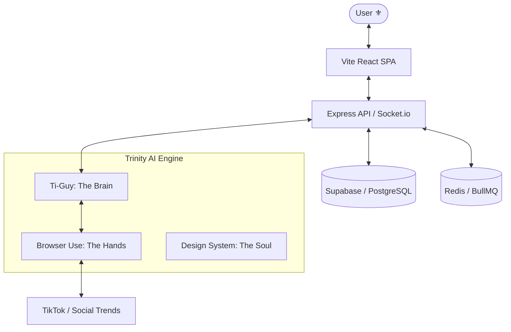

# 🐝 Zyeuté - L'app sociale du Québec ⚜️

[](https://zyeute.com)
[](https://zyeutev5-1.onrender.com)
[](https://supabase.com)

**Zyeuté** is the premier social video platform dedicated to Quebec culture. Built with high-performance tech and deep AI integration, it brings the "TikTok" experience to the Fleur-de-lis province.

---

## 🏗 System Architecture (The Trinity)

Zyeuté is powered by the **Trinity System**, a triple-layered AI architecture designed for cultural relevance and technical excellence.



### 🧠 The Brain (Ti-Guy)
The AI orchestrator that ensures all content and interactions adhere to Quebec cultural standards. It handles sentiment analysis, trend identification, and automated moderation.

### 🤲 The Hands (Browser Use)
An automated trend-discovery engine that uses browser automation to scan global platforms for Quebec-specific trends, populating the feed with relevant content.

### 🎨 The Soul (Design System)
A premium design system inspired by Quebec's heritage, utilizing "Antique Gold" and "Rich Leather" aesthetics to create a high-ticket, luxury feel.

---

## 🛠 Tech Stack

- **Frontend**: React 19 + Vite + Tailwind CSS 4
- **Backend**: Node.js Express + Socket.io (Real-time)
- **Database**: Supabase (PostgreSQL) + Drizzle ORM
- **Queue/Cache**: Redis + BullMQ (Video Processing)
- **AI**: Google Vertex AI (Gemini 2.0) + OpenAI + DeepSeek
- **Hosting**: Vercel (Frontend) + Render (Backend/Workers)

---

## 🚀 Getting Started

### Prerequisites
- Node.js 20+
- PNPM or NPM
- Python 3.12+ (for automation)

### Installation

```bash
# 1. Clone & Install
git clone https://github.com/brandonlacoste9-tech/ZyeuteV5.git
cd ZyeuteV5
npm install

# 2. Environment Setup
cp .env.example .env
# Fill in Supabase, Redis, and AI API keys
```

### Development

```bash
# Start backend and frontend (Vite)
npm run dev
```

---

## 🛡 Security & Quality

We maintain high standards for security and code quality:
- **RLS**: Row Level Security enabled on all core tables.
- **Audit**: Custom security scanner (`npm run audit:security`).
- **Linting**: Strict ESLint and Prettier rules.
- **Testing**: Playwright E2E and Vitest unit tests.

---

## 🗺 Roadmap

- [x] Phase 1: Core Video Pipeline
- [x] Phase 2: Social Interactions (Follows, Comments)
- [x] Phase 3: Real-time Chat & Notifications
- [ ] Phase 4: Monetization (Stripe Integration)
- [ ] Phase 5: Advanced AI Evolution Engine

---

Built with ❤️ in Québec. ⚜️
